#  Ansible modules
Ansible modules are small programs that define how and when to perform automation tasks on a remote host or local machine.They are also known as "task plugins" or "library plugins".


 #  Run  commands based on the following conditions:
## 1. To establish connection with the node server.
- Run the following  command

   - ``` ssh ubuntu@<IP> ```

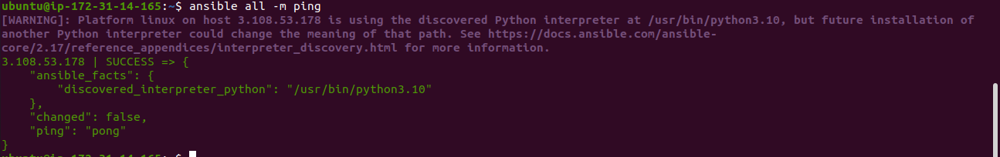


## 2. To add team ninja.
- Run the following  command

   - ``` ansible all -m group -a "name=ninja" -b ```

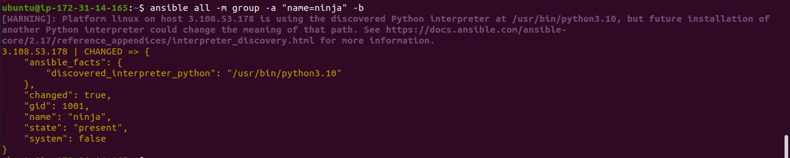
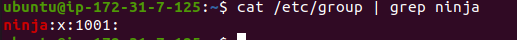


## 3. To add user Nitish in team ninja.
- Run the following  command

   - ``` ansible all -m user -a "name=Nitish group=ninja" -b ```

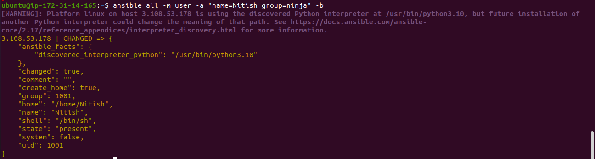
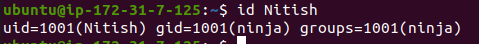


## 4. A user should have read,write, execute access to home directory.
- Run the following  command

   - ``` ansible all -m file -a "dest=/home/Nitish mode=751 owner=Nitish group=ninja" -b ```

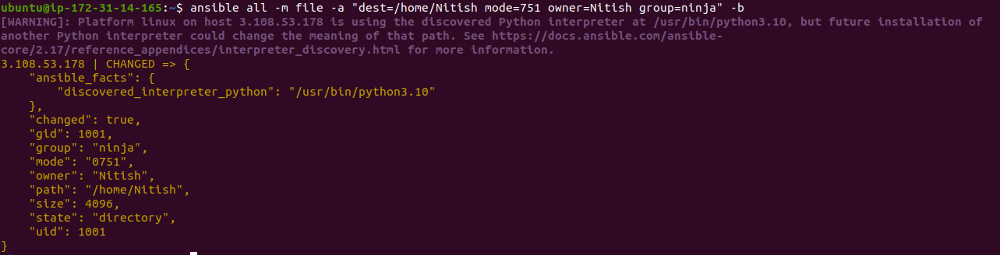


## 5. In home directory of every user there should be 2 shared directories.
- Run the following  command

   - ``` ansible all -m file -a "dest=/home/Nitish/TEAM state=directory” -b ```
   - ``` ansible all -m file -a "dest=/home/Nitish/TEAM state=directory” -b ```

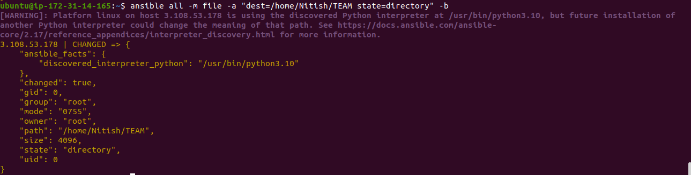


## 6. Team: The same team members will have full access.
- Run the following  command

   - ``` ansible all -m file -a "path=/home/Nitish/TEAM group=group_name owner=Nitish" -b ```
 


## 7. Ninja: All ninja's will have full access.
- Run the following  command

   - ``` ansible all -m file -a "path=/home/Nitish/NINJA group=common_group owner=Nitish" -b ```

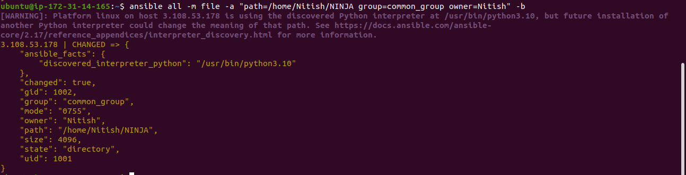
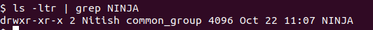


## 8. Change user Shell.
- Run the following  command

   - ``` ansible all -m user -a "name=Nitish shell=/bin/bash" -b ```

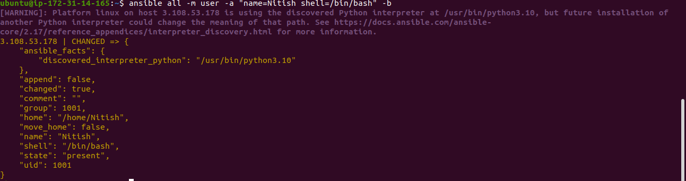
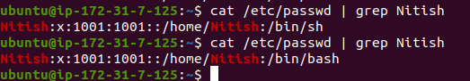


## 9. Change user password.
- Run the following  command

   - ``` ansible all -m user -a "name=Nitish update_password=always password={{ newpassword|password_hash('sha512') }}" -b --extra-vars "newpassword=1234" ```

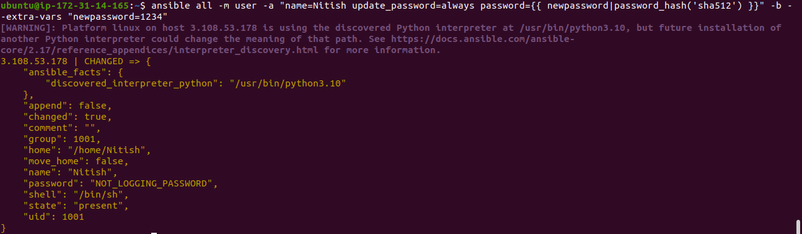


## 10. Delete user.
- Run the following  command

   - ``` ansible all -m user -a "name=alpha state=absent" -b ```

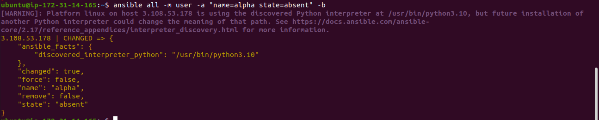
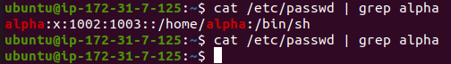


## 11. Delete Group.
- Run the following  command

   - ``` ansible all -m group -a "name=gamma state=absent" -b ```

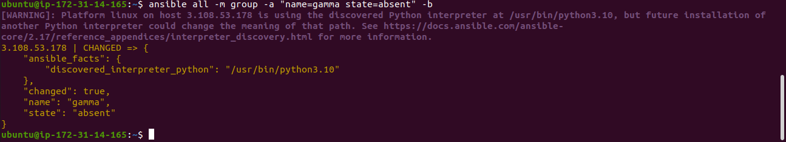


## 12. List user or Team.
- Run the following  command

   - ``` ansible all -m command -a "getent group" -u ubuntu@ip-172-31-7-125 -b ```


   - ``` ansible all -m command -a "getent passwd" -u ubuntu@ip-172-31-7-125 -b ```
  


