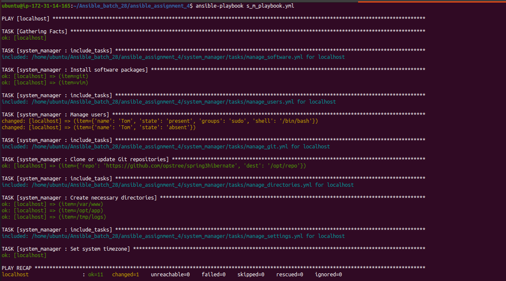

#  Ansible role
An Ansible role is a collection of tasks, variables, files, handlers, and other assets that can be reused and shared across Ansible playbooks


 #  Run  commands based on the following conditions:
## 1. To run the playbook.
- Run the following  command

   - ``` ansible-playbook s_m_playbook.yml ```



