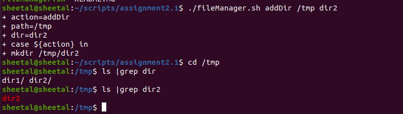

#  file management
File Managers are something that is required to manage our daily activities quickly. Using file managers, we can copy, move, rename, and delete files, manage space, manage disks, etc.


 #  Run  commands based on the following conditions:
## 1. to add directory.
- Run the following  command

   - ``` ./FileManager.sh addDir /tmp dir1 ```


