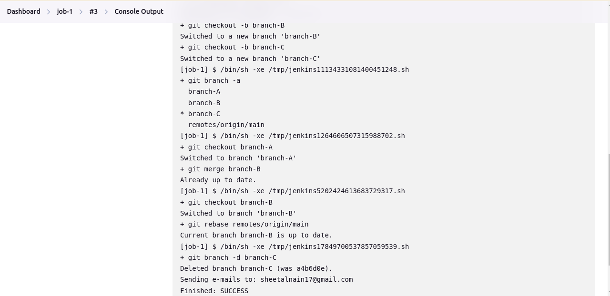
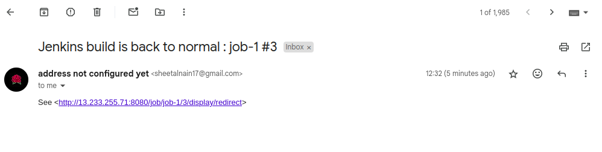
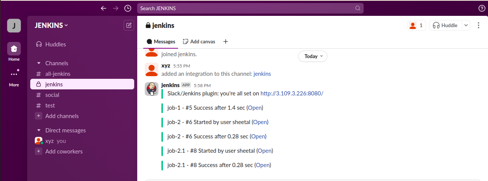
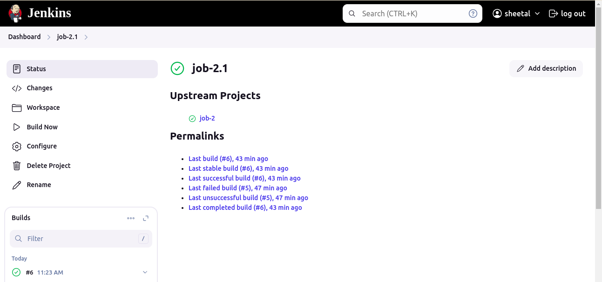
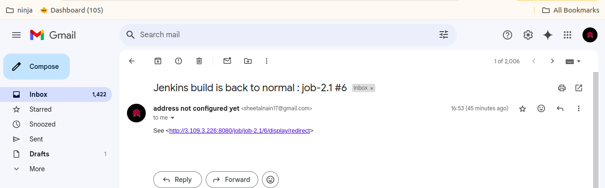
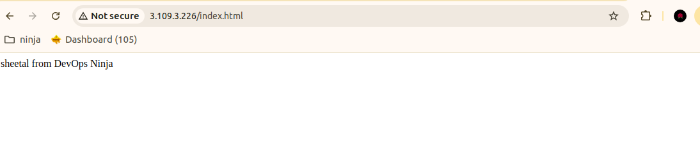

#  Jenkins Job
With the help of jenkins job , we can pull the source code from version control, create it build, run tests, verify the status of builds and deploy, etc. Types of Jenkins Jobs are Freestyle Project, Maven Project, Pipeline, Multi-configuration Project, and GitHub Organization.

## 1. Part-1
`

## 2. Mail-notification for job-1.

## 3. Slack notification for job-1.

## 4. Part-2

## 5. Mail-notification for job-2.

## 6. Final result.

