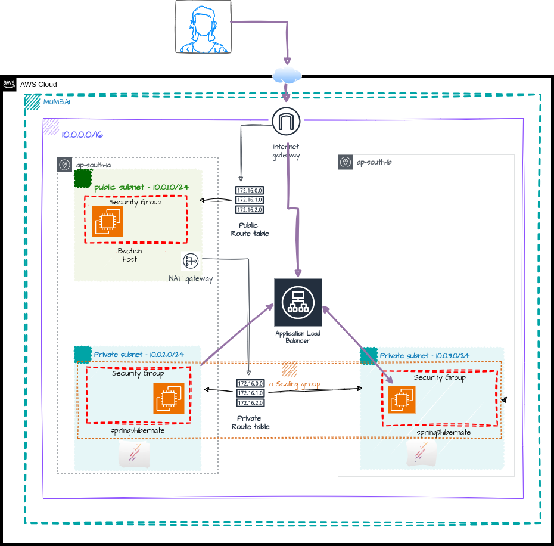
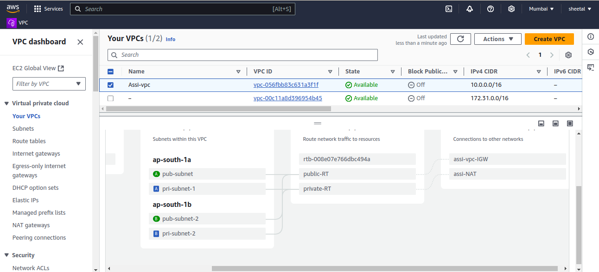
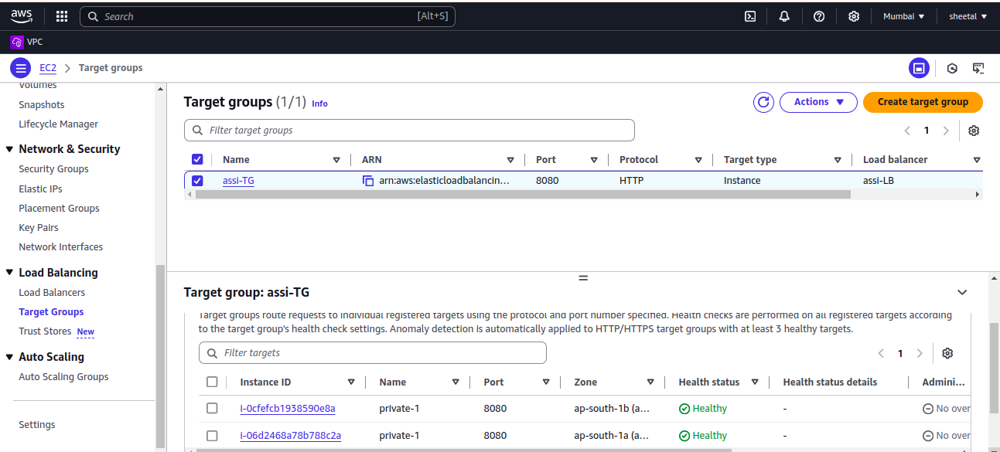
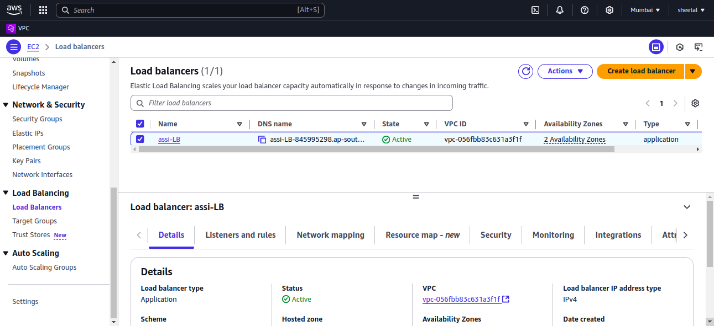
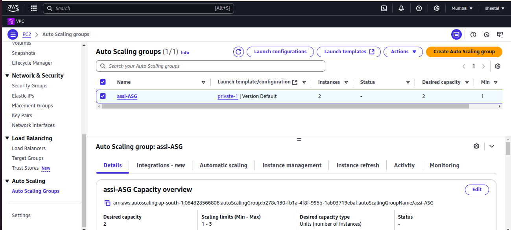
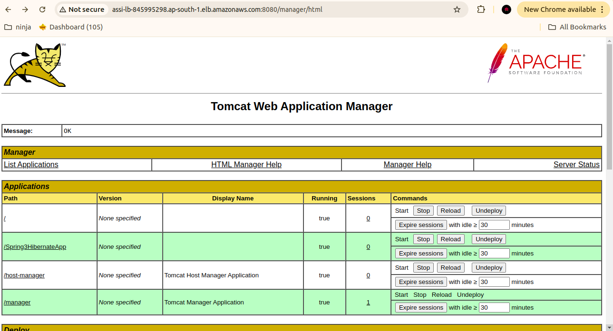
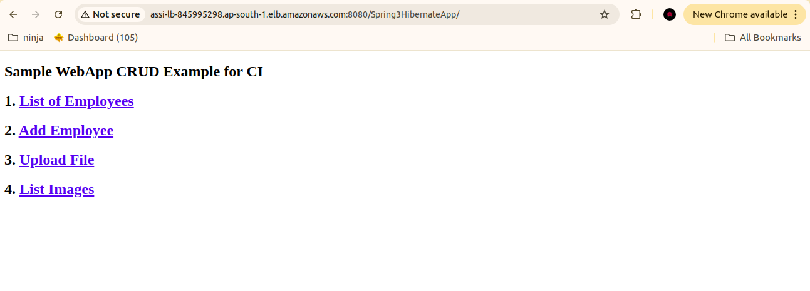

# An AWS Load Balancer is a service that automatically distributes incoming application traffic across multiple targets, such as Amazon EC2 instances, containers, and IP addresses. This helps ensure that no single instance bears too much load, which can lead to performance degradation or downtime.

An Auto Scaling Group (ASG) is a feature of AWS that automatically adjusts the number of EC2 instances in response to changing demand. It helps maintain application availability and allows you to scale your EC2 capacity up or down automatically according to conditions you define.

## 1. Infra diagram.
`

## 2. The VPC resource map of the infra created.

## 3. Target group created for the infra.

## 4. Load balancer created for the infra.

## 5. Auto-scaling group created for the infra.

## 6. Deploying the application on tomcat.

## 7. Final result of the Spring3hibernate app deployment.

