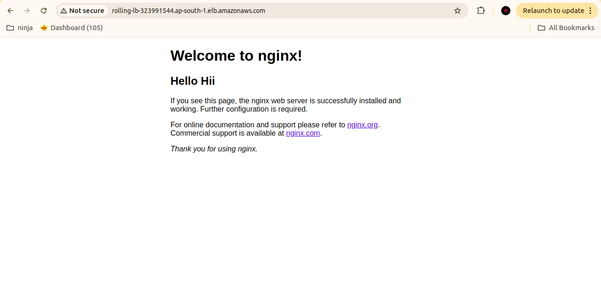

# Recreate Deployment
In a recreate deployment strategy, the existing version of the application is completely stopped and removed before the new version is deployed. This means that there is a period during which the application is not available to users..

Rolling Deployment
A rolling deployment strategy updates the application incrementally by replacing instances of the old version with the new version gradually. This allows for the application to remain available during the update process.

## 1. Step-1 Create an instance and install nginx in it.
`
## 2. Step-2 Access the nginx page with the default configuration.

## 3. Step-3 Make some changes in the configuration.

## 4. Step-4 Make an AMI with the changed configuration and launch an instance with this AMI.

## 5. Step-5 Create an auto-scaling group that uses the AMI with changed configuration.

## 6. Step-6 The instance thus created will have the changed configuration.

## 7. Step-7 Access the nginx page and we will se the page with changed configuration.

