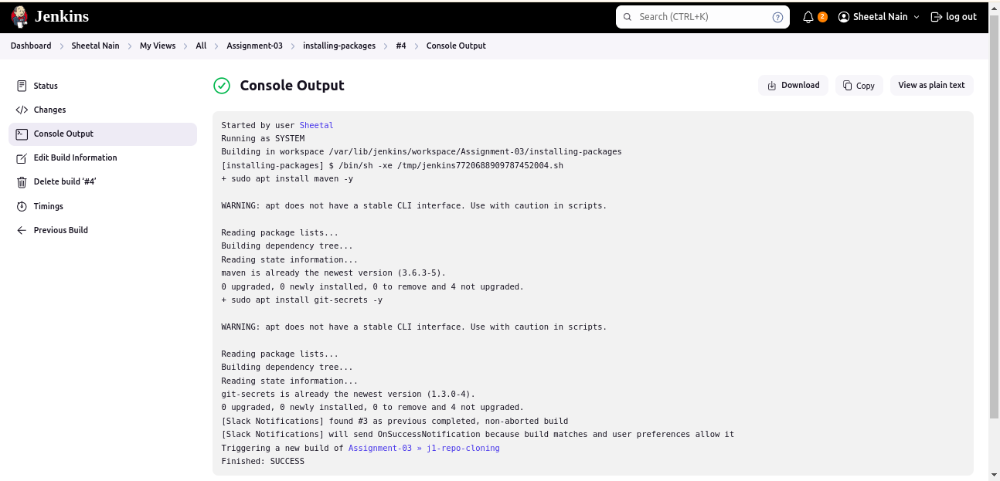
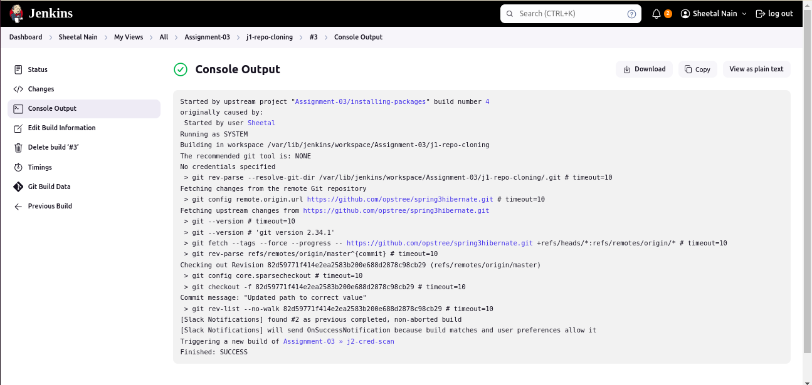
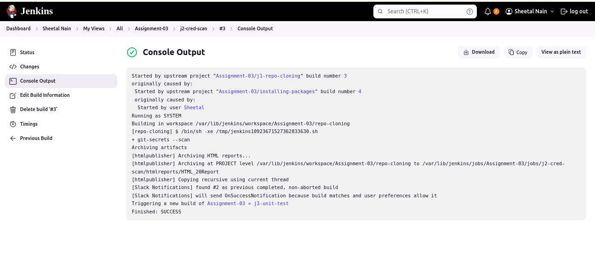
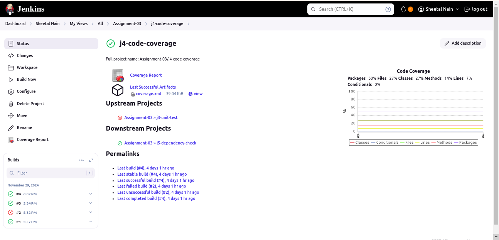
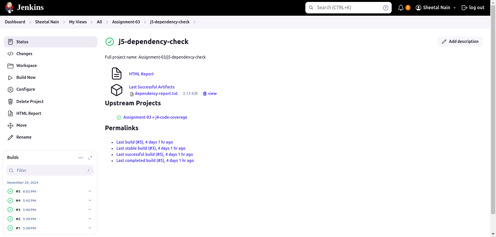
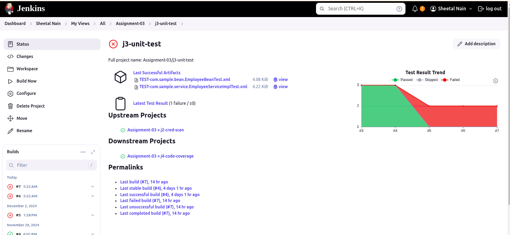

#  Jenkins CI checks.

Continuous Integration (CI) checks in Jenkins are automated processes that ensure code quality and functionality before changes are merged into the main codebase. These checks typically include building the application, running tests, and performing static code analysis.

## 1. Installing packages.
`

## 2. Cloning repository.

## 3. Credential scanning.

## 4. Code coverage.

## 5. Dependency check.

## 6. Unit test.

