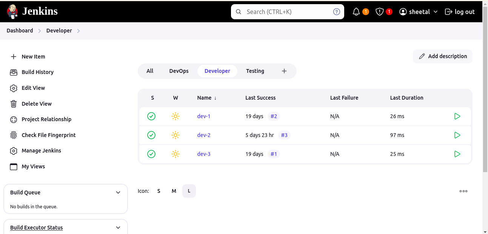
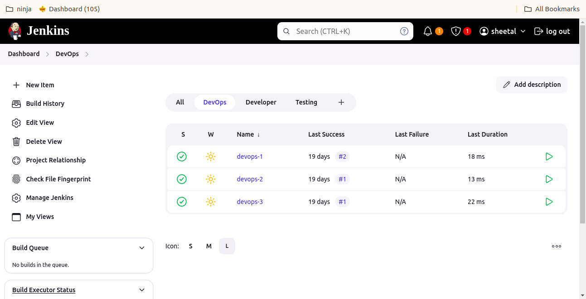
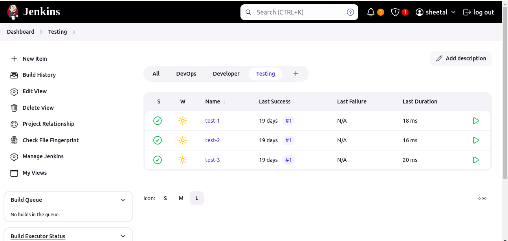
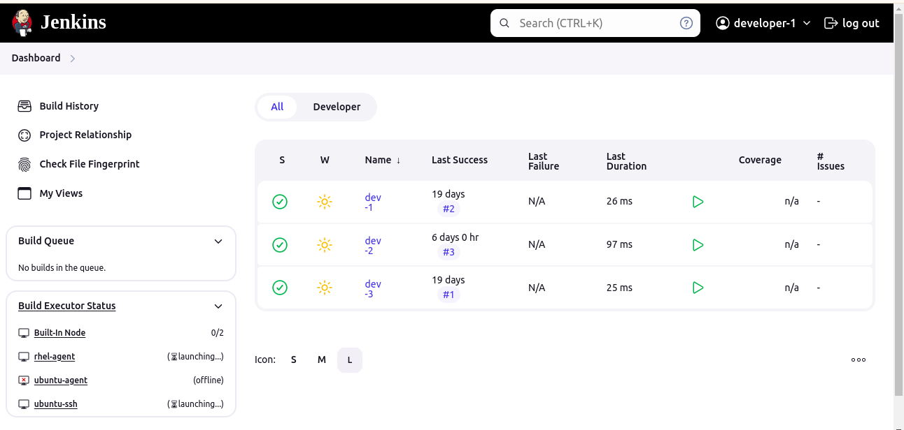
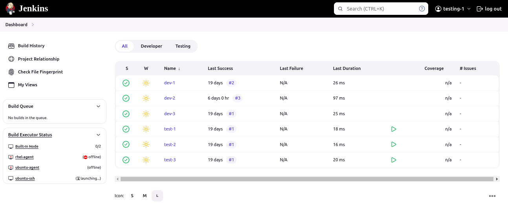
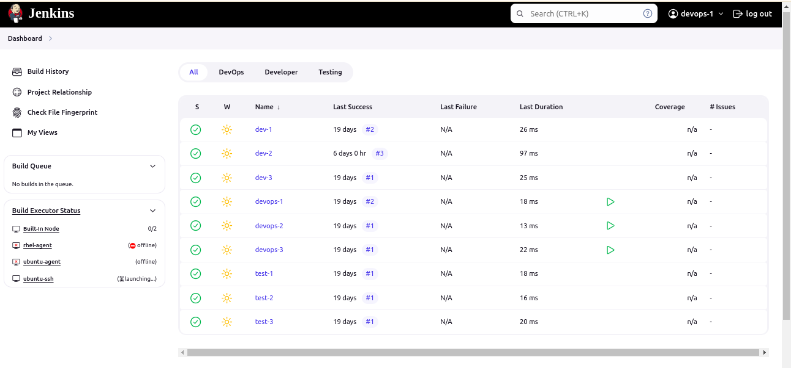
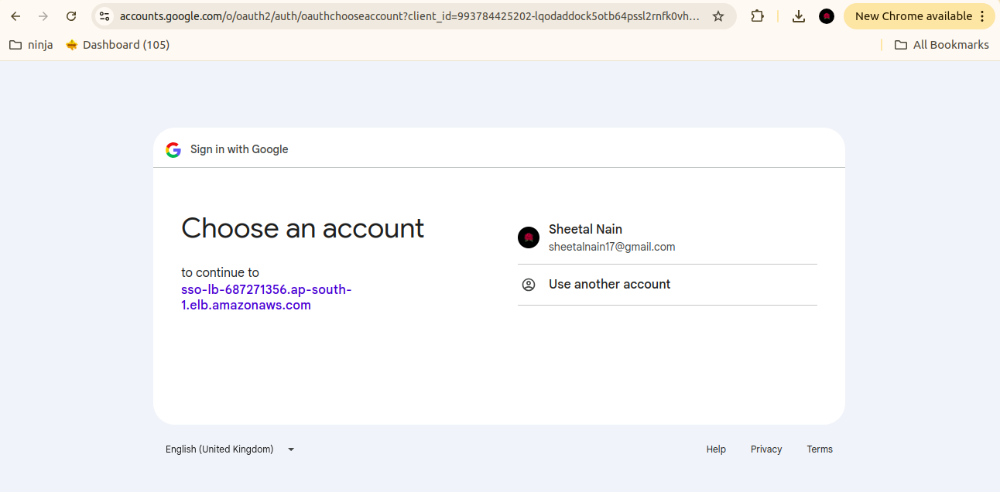
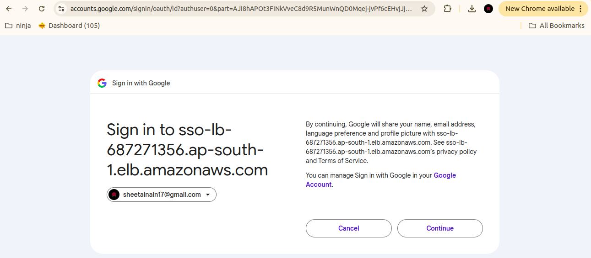
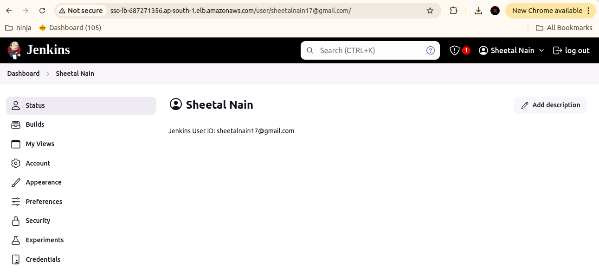

#  Jenkins Authentication and Authorization.

Authentication: Verifying the identity of a user (e.g., logging in with a username and password).

Authorization: Granting or restricting access to resources and actions based on the user's identity and assigned permissions.

These two concepts are fundamental to securing any software system, including Jenkins, ensuring that only authorized users can access sensitive operations and data.

## 1. Part-1 : Developer's jobs.
`

## 2. Devops jobs.

## 3. Testing jobs.

## 4. Developer: [ They can see only dev jobs, can build it, see workspace and configure it ]

## 5. Testing: [ They can see all test jobs, can build it, see workspace and can configure it, | They can also view dev jobs ]

## 6. Devops:  [ They can see all devops jobs, can build it, see workspace and can configure it, | They can also view dev and test jobs  ]

## 7. Part-2 Enable SSO with Google for admin user.

