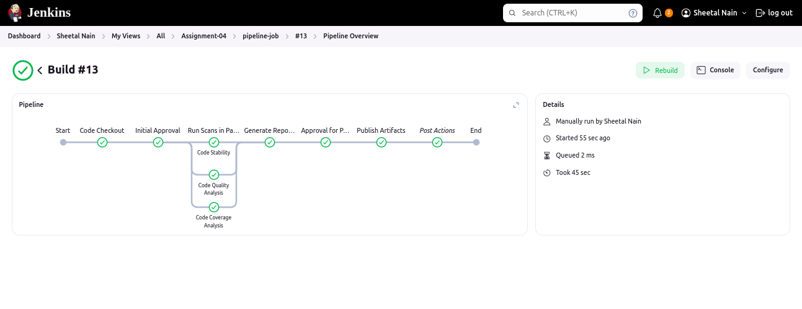
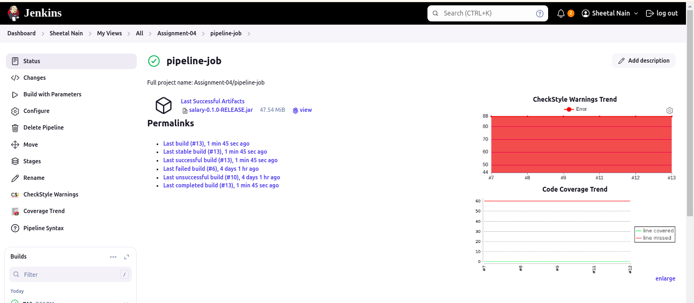
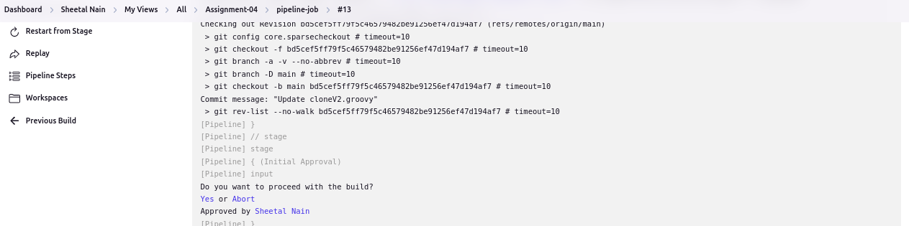
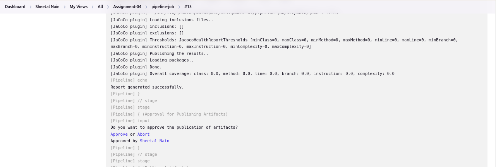

#  Jenkins declerative CI pipeline.

A Jenkins Declarative Pipeline is a simplified and more structured way to define a Jenkins pipeline using a specific syntax. It allows you to create CI/CD workflows in a more readable format compared to the traditional Scripted Pipeline. Declarative Pipelines are defined within a pipeline block and consist of various stages, steps, and post actions.

## 1. Pipeline overview.
`

## 2. Pipeline status.

## 3. Parameters defined.

## 4. The user should be able to skip various scans during build execution

## 5. Before publishing there should be an approval stage to be set in place to approve or deny the publication.

