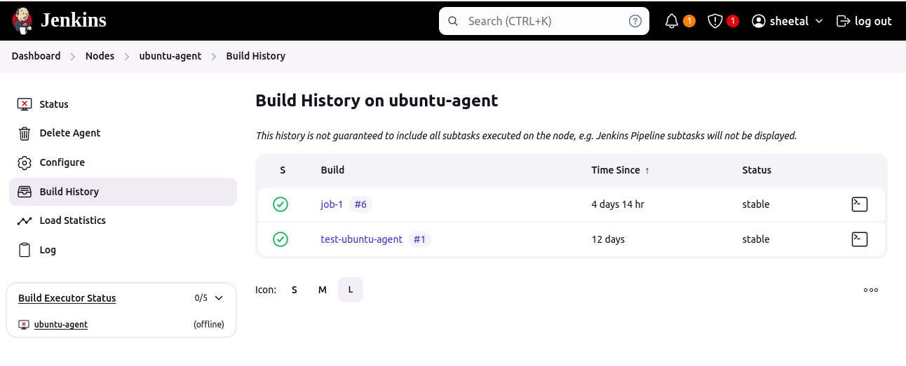
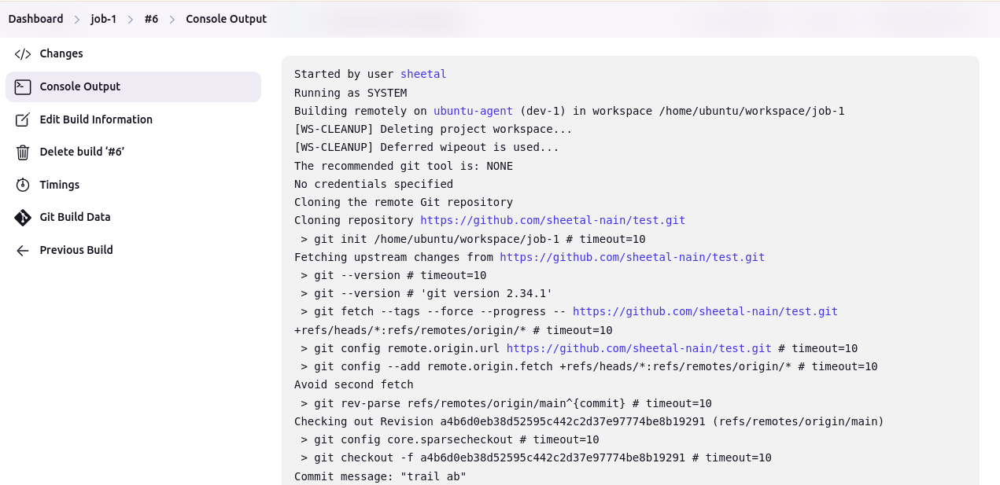
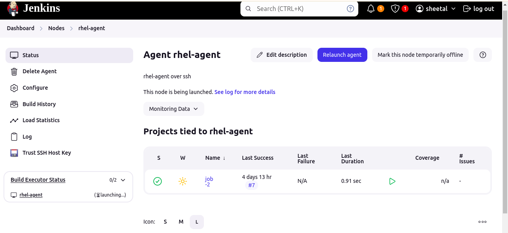
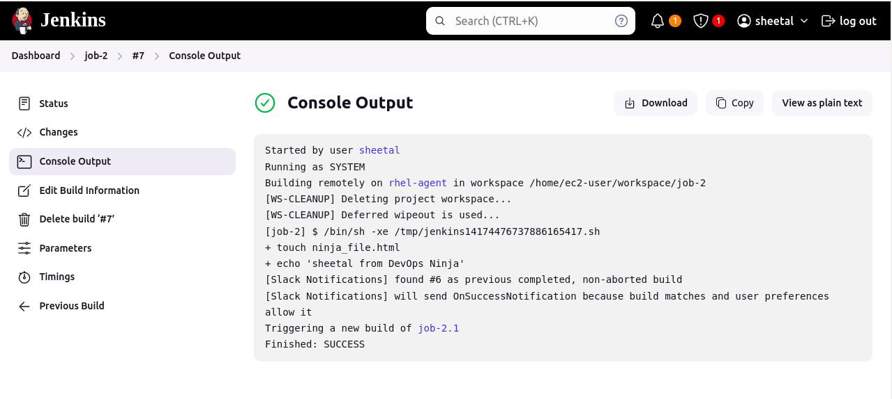

#  Jenkins master-slave architecture.

The Jenkins Master-Agent Architecture is a distributed system design that allows Jenkins to efficiently manage and execute Continuous Integration (CI) and Continuous Deployment (CD) tasks across multiple machines. This architecture separates the responsibilities of job scheduling and execution, enabling better resource utilization, scalability, and flexibility in managing build environments.

## 1. Ubuntu-agent.
`

## 2. Redhat-agent.

